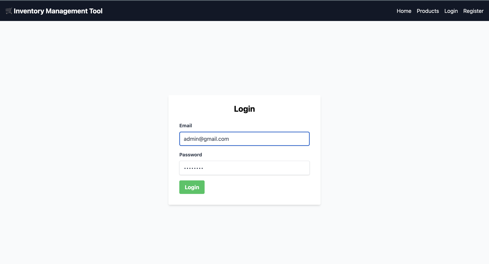

# 🛒 MERN Stack Product Inventory Management System

A full-stack MERN application with user authentication and admin portal where:
- Users can view products.
- Admins can add new products and update quantities directly from the UI.
- Basic analytics and toast notifications are integrated.
- Fully Dockerized for easy deployment.

---

## 📌 Features

- 🔐 **Authentication**: JWT-based login with cookies
- 🧑‍💼 **Admin Portal**:
  - Add Products
  - Update Quantity Inline
- 📊 **Basic Analytics**
- 🧾 **RESTful APIs** with error handling
- ⚛️ **React Frontend** (Vercel deployed)
- 🌐 **Node.js + Express Backend** (Render hosted)
- 🐳 **Dockerized**

---

## 🔧 Tech Stack

| Area       | Technology                      |
|------------|----------------------------------|
| Frontend   | React, Tailwind CSS, Axios, Toastify |
| Backend    | Node.js, Express, Mongoose       |
| Database   | MongoDB (Atlas)                  |
| Auth       | JWT + Cookies (httpOnly, secure) |
| Hosting    | Vercel (Frontend), Render (Backend) |
| Docker     | Docker, Docker Compose           |

---

## 🗂️ Code Structure

📦 root/
├── backend/
│ ├── controllers/
│ ├── models/
│ ├── routes/
│ ├── middleware/
│ └── server.js
├── frontend/
│ ├── src/
│ │ ├── components/
│ │ ├── pages/
│ │ ├── services/
│ │ └── App.jsx
│ └── public/
├── docker-compose.yml
├── Dockerfile
├── README.md
└── assets/

---

## 📦 API Endpoints

### ✅ 1. **User Authentication**

#### POST `/auth/signup`
- **Payload:** `{ name, email, password }`
- **Returns:** `user info + token`

#### POST `/auth/login`
- **Payload:** `{ email, password }`
- **Returns:** `user info + token`
- **Cookie:** httpOnly + secure

---

### ✅ 2. **Products**

#### GET `/products`
- **Params:** `?page=1&limit=10`
- **Returns:** List of products (paginated)
- **Auth Required:** ✅

#### POST `/products`
- **Payload:** `{ name, price, quantity }`
- **Returns:** Created product
- **Admin Only:** ✅

#### PUT `/products/:id/quantity`
- **Payload:** `{ quantity: number }`
- **Returns:** Updated product
- **Admin Only:** ✅

---

## ⚙️ Setup Instructions

### 📍 Prerequisites
- Node.js, MongoDB Atlas URI
- Docker (optional)

---

### 🔑 Backend Setup

```bash
cd backend
npm install
# Create .env
PORT=5500
MONGO_URI=your_mongodb_uri
JWT_SECRET=your_jwt_secret
FRONTEND_URL=https://your-frontend.vercel.app

npm run dev
💻 Frontend Setup
bash
Copy
Edit
cd frontend
npm install
npm run dev
🐳 Docker Setup
Add .env in backend

Use this in root:

bash
Copy
Edit
docker-compose up --build
This will start both frontend and backend services.

📸 Screenshots
🔹 Home Page  



🔹 Admin Dashboard

🔹 Update Product Quantity

🔹 Toast Notification Example

🔹 API Test (Postman)

🔹 Docker Running

🧪 Testing & Error Handling
Every API returns a JSON error message on failure.

Tested using:

Frontend UI

Postman

Edge cases: invalid input, unauthorized, missing fields

📜 Submission Checklist
✅ GitHub Repo with Codebase
✅ Setup Instructions
✅ API Documentation
✅ Database Schema via Mongoose
✅ Admin Portal
✅ Dockerized
✅ Analytics & Toasts
✅ Paginated GET API

🧑‍💻 Author
Chirag Sharma — Final Year CSE, IIIT Bhagalpur
GitHub: @sharmachirag760

